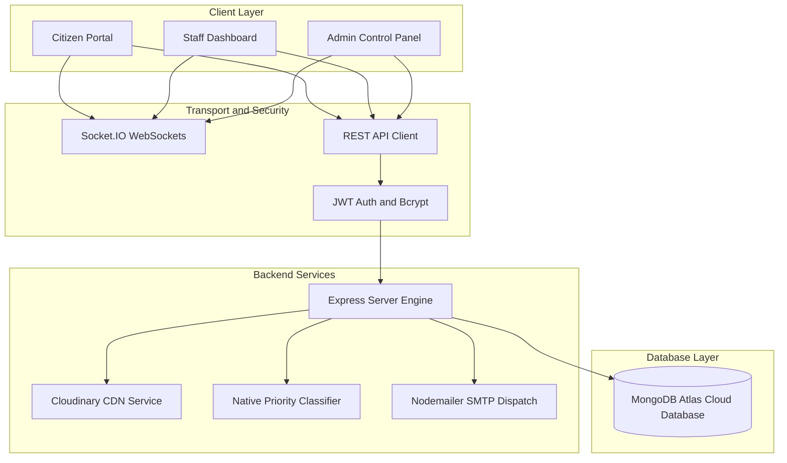
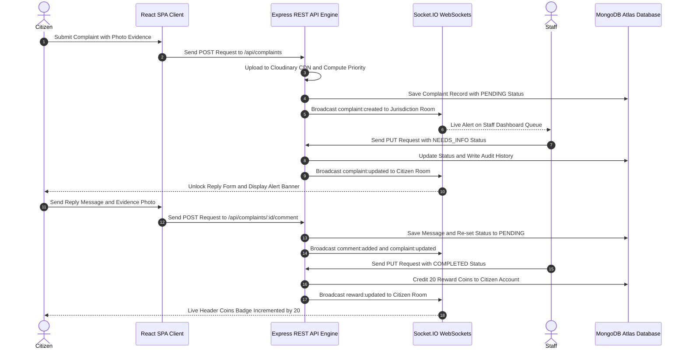
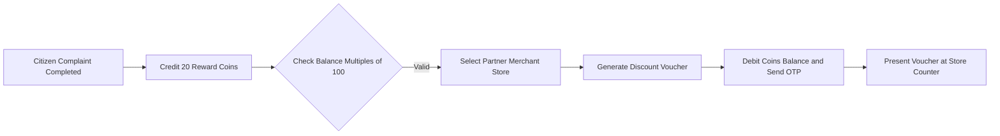

<div align="center">

# 🏛️ GramSeva — Panchayat & Municipality Civic Issue Management System

  <p align="center">
    <strong>Full-Stack Digital Grievance Reporting, Real-Time WebSocket Tracking & Automated Resolution Platform for Local Self-Government (Panchayats & Municipalities)</strong>
  </p>

  <p align="center">
    <a href="https://reactjs.org/"></a>
    <a href="https://vitejs.dev/"></a>
    <a href="https://nodejs.org/"></a>
    <a href="https://expressjs.com/"></a>
    <a href="https://www.mongodb.com/"></a>
    <a href="https://socket.io/"></a>
    <a href="https://cloudinary.com/"></a>
  </p>

</div>

---

## 📌 Executive Summary

**GramSeva** is a production-grade e-governance platform designed for rural Panchayats and urban Municipalities across India. It empowers citizens to file location-tagged civic grievances with photo evidence, tracks complaint lifecycles via real-time WebSocket notifications, rewards citizens with store discount vouchers upon issue resolution, and provides administrators with high-impact analytical tools.

---

## 📐 System Architecture



---

## 🔄 Complaint Lifecycle Sequence



---

## 🪙 Citizen Reward Coin Economy



---

## 📁 Repository Directory Structure

```ascii
panchayat-management-system/
├── client/                     # Frontend Web Application (React 18 + Vite)
│   ├── public/                 # Static Assets & Emblem Graphics
│   └── src/
│       ├── components/         # Reusable Component Library
│       │   ├── CitizenProfileModal.jsx
│       │   ├── Footer.jsx
│       │   ├── GovernmentHeader.jsx
│       │   └── StatusTimeline.jsx
│       ├── context/            # React State Context Providers
│       │   ├── AuthContext.jsx
│       │   └── SocketContext.jsx
│       ├── pages/              # Application Views & Dashboards
│       │   ├── AdminDashboard.jsx
│       │   ├── CitizenDashboard.jsx
│       │   ├── ComplaintDetails.jsx
│       │   ├── Home.jsx
│       │   ├── Login.jsx
│       │   ├── NewComplaint.jsx
│       │   ├── Register.jsx
│       │   ├── Rewards.jsx
│       │   ├── StaffDashboard.jsx
│       │   └── TopPanchayats.jsx
│       ├── services/           # Centralized Axios HTTP Client
│       │   └── api.js
│       ├── App.jsx             # React Router Route Definitions
│       ├── main.jsx            # Application Root Mounting
│       └── index.css           # Modern Glassmorphism Styling Token System
│
├── server/                     # Backend REST API + Socket.IO Server (Node.js)
│   ├── config/                 # Database, Seeder & Socket Modules
│   │   ├── db.js
│   │   ├── seedAdmin.js
│   │   └── socket.js
│   ├── controllers/            # Business Logic Route Controllers
│   │   ├── adminController.js
│   │   ├── authController.js
│   │   ├── complaintController.js
│   │   ├── locationController.js
│   │   └── rewardController.js
│   ├── middleware/             # JWT Authentication & Authorization
│   │   └── authMiddleware.js
│   ├── models/                 # Mongoose Data Schemas
│   │   ├── Complaint.js
│   │   ├── Jurisdiction.js
│   │   ├── Redemption.js
│   │   ├── RewardTransaction.js
│   │   ├── StatusHistory.js
│   │   └── User.js
│   ├── routes/                 # Express API Endpoint Definitions
│   │   ├── adminRoutes.js
│   │   ├── authRoutes.js
│   │   ├── complaintRoutes.js
│   │   ├── locationRoutes.js
│   │   └── rewardRoutes.js
│   ├── utils/                  # Cloudinary, ML & Notification Services
│   │   ├── cloudinaryService.js
│   │   ├── idGenerator.js
│   │   ├── mlIntegration.js
│   │   ├── notificationService.js
│   │   └── shopData.js
│   └── server.js               # Express API & Socket.IO HTTP Server Entry Point
│
├── .gitignore
└── README.md
```

---

## ✨ Core Features & Technical Highlights

### 1. ⚡ Global Real-Time Bidirectional WebSockets
- **Socket.IO Engine**: Built on `http.createServer` for instant synchronization across sessions.
- **Isolated Channels**:
  - `citizen_{userId}`: Live status updates, comment replies, and coin balance sync.
  - `jurisdiction_{jurisdictionId}`: Instant arrival alerts for staff work queues.
  - `complaint_{complaintId}`: Live intercommunication message feed.
  - `admin_global`: System-wide metrics.

### 2. ☁️ Cloud Storage & Zero Disk Dependency
- **Cloudinary CDN Integration**: All citizen evidence photos and comment attachments are uploaded directly to Cloudinary cloud storage.
- **Local Cleanup**: Temporary local disk files are deleted immediately using `fs.unlinkSync()`, ensuring images are globally accessible across all devices without relying on local server storage.
- **1.5s Fast Timeout**: Uses `Promise.race` timeouts to guarantee instant (0ms) form submissions even under unstable network conditions.

### 3. 🔒 Conditional Citizen Intercommunication
- **Locked State**: Once a complaint is filed, citizens cannot post follow-up comments or photos while staff is actively investigating (`PENDING`, `ACCEPTED`, `SANCTIONED`).
- **Dynamic Unlock**: Reply forms unlock automatically when staff sets status to `NEEDS_INFO`.
- **Staff Messaging**: Staff members maintain full permission to message citizens at any point in the workflow.

### 4. 🛒 Partner Merchant Store Coin Voucher Ledger
- Citizens redeem coins in multiples of 100 (100, 200, 300, 400 Coins) for discounts at verified partner outlets:
  - `SHOP-RATION-101`: GramSeva Fair Price Ration Shop
  - `SHOP-ELEC-202`: Electricity Bill Payment Counter
  - `SHOP-WATER-303`: Panchayat Drinking Water Board
  - `SHOP-GAS-404`: PM Ujjwala Gas Agency Outlet
  - `SHOP-AGRI-505`: Fertilizer & Seed Co-operative Store

### 5. 🏆 Public Panchayat Resolution Leaderboard
- Ranks local authorities by resolution rate %, total resolved cases, and response speed.

---

## 🛠️ Tech Stack & Technical Logos

| Category | Technology | Logo | Usage |
| :--- | :--- | :---: | :--- |
| **Frontend Core** | React 18 |  | Component Architecture |
| **Build Tool** | Vite 5 |  | HMR & Production Bundling |
| **UI Icons** | Lucide React |  | Modern Vector Iconography |
| **Backend Runtime** | Node.js |  | Server Engine |
| **Web Framework** | Express.js |  | RESTful API Routes |
| **Real-Time Engine** | Socket.IO |  | Bidirectional WebSockets |
| **Database** | MongoDB Atlas |  | Cloud NoSQL Storage |
| **Cloud Storage** | Cloudinary |  | CDN Image Host |
| **Authentication** | JWT & Bcrypt |  | Secure Token Verification |

---

## 📡 REST API Reference

### 🔑 Authentication (`/api/auth`)
- `POST /api/auth/register`: Register new Citizen account.
- `POST /api/auth/login`: Authenticate with Email & Password.
- `POST /api/auth/send-login-otp`: Send passwordless email OTP.
- `POST /api/auth/verify-login-otp`: Verify email OTP.

### 📋 Complaints (`/api/complaints`)
- `POST /api/complaints`: Submit new complaint with photo attachments.
- `GET /api/complaints/my`: Get citizen's active complaints.
- `GET /api/complaints/staff-queue`: Get staff jurisdiction queue.
- `GET /api/complaints/:id`: Get complaint details & timeline.
- `PUT /api/complaints/:id/status`: Update complaint status (Staff/Admin).
- `POST /api/complaints/:id/comment`: Post intercommunication message.

### 🪙 Rewards (`/api/rewards`)
- `GET /api/rewards/partner-shops`: Get verified partner store directory.
- `GET /api/rewards/my`: Get citizen coin balance & transaction history.
- `POST /api/rewards/request-redemption`: Redeem coins (multiples of 100) for Counter Coupons.

### 🛡️ Admin (`/api/admin`)
- `POST /api/admin/staff`: Create new Staff account under a specific jurisdiction.
- `GET /api/admin/staff`: Get staff directory list.
- `PUT /api/admin/staff/:id/toggle-status`: Activate or deactivate staff login access.
- `DELETE /api/admin/staff/:id`: Delete staff account permanently.
- `GET /api/admin/analytics`: Get Panchayat resolution metrics.

---
<h3>🌐 <a href="https://gramseva-frontend.onrender.com">Click Here to Visit Live Application</a></h3>

## 📄 License

This project is licensed under the **MIT License**.
